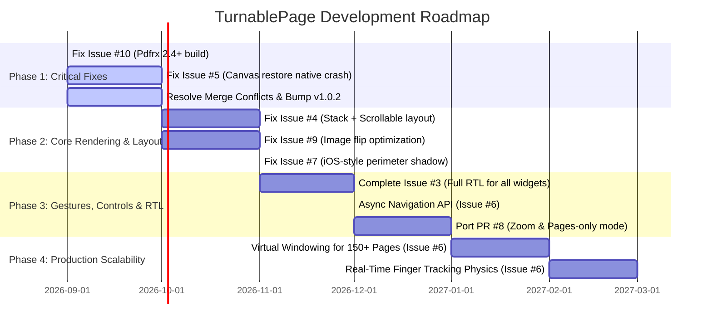

# Project TODO & GitHub Issues Roadmap

This document consolidates and organizes all active and notable issues and pull requests pulled directly from GitHub for [`saeedahmed725/turnable_page`](https://github.com/saeedahmed725/turnable_page). It includes detailed technical root causes, reproduction conditions, proposed solutions, and a phased implementation roadmap.

---

## 📊 Issues & PRs Matrix

| # | Type | Title | State | Priority | Area |
|---|---|---|---|---|---|
| [#10](https://github.com/saeedahmed725/turnable_page/issues/10) | Issue | Build failure with Flutter 3.38.9+ (`Pdfrx.getCacheDirectory` setter not found) | Open | 🔴 P0 (Critical) | Dependencies / Build |
| [#5](https://github.com/saeedahmed725/turnable_page/issues/5) | Issue | Bad state: A Dart object attempted to access a native peer (`canvas.restore()` nullptr crash with `CachedNetworkImage`) | Open | 🔴 P0 (Critical) | Rendering Engine / Skia |
| [#9](https://github.com/saeedahmed725/turnable_page/issues/9) | Issue | Rendering issue on API-based image content during page flipping | Open | 🟡 P1 (High) | Image Rendering |
| [#4](https://github.com/saeedahmed725/turnable_page/issues/4) | Issue | `Stack` + `SingleChildScrollView` rendering problems inside `TurnablePage` | Open | 🟡 P1 (High) | Layout / Constraints |
| [#6](https://github.com/saeedahmed725/turnable_page/issues/6) | Issue | Production App Feedback: Gesture Harmony, Real-time Finger Physics, Scalability & Async Navigation API | Open | 🟡 P1 (High) | Architecture / Gestures / API |
| [#7](https://github.com/saeedahmed725/turnable_page/issues/7) | Issue | Page turning visual improvement: iOS `UIPageViewController`-style all-around boundary shadow | Open | 🟢 P2 (Medium) | Shader / Shadows |
| [#3](https://github.com/saeedahmed725/turnable_page/issues/3) | Issue | RTL (Right-to-Left) book direction support for Arabic / Hebrew | Open | 🟢 P2 (Medium) | I18n / Navigation |
| [#8](https://github.com/saeedahmed725/turnable_page/pull/8) | PR (Closed) | Add zoom support, configurable center shadow, and pages-only mode | Closed | 🟢 P2 (Feature) | New Capabilities |
| [#12](https://github.com/saeedahmed725/turnable_page/pull/12) | PR (Merged) | Flutter 3.41+ upgrade, modern iOS embedding, and Pdfrx update | Merged | ✅ Resolved | Upstream Sync |

---

## 🛠️ Detailed Issue Breakdown & Action Plans

### 1. Issue #10: Build Failure with Flutter 3.38.9+ (`Pdfrx.getCacheDirectory`)
- **Reported By:** `@alijamalizadeh`
- **Error:**
  ```text
  lib/src/widgets/turnable_pdf.dart:237:11: Error: Setter not found: 'getCacheDirectory'.
      Pdfrx.getCacheDirectory ??= () async { ... }
  ```
- **Root Cause:**
  `pdfrx` deprecated and removed the `getCacheDirectory` setter in newer versions in favor of `Pdfrx.cacheDirectoryPath`.
- **Status in Codebase:**
  - Resolved on `origin/main` via PR #12 (commit `70ac849`), switching to `Pdfrx.cacheDirectoryPath ??= cacheDir.path` and upgrading `pdfrx` to `^2.4.4`.
- **Action Items:**
  - [x] Integrate fix into `main` branch.
  - [ ] Resolve lockfile merge conflict on `example/pubspec.lock`.
  - [ ] Verify build with `flutter build` on latest Flutter (3.41+ / 3.44+).
  - [ ] Bump version in `pubspec.yaml` to `1.0.2` and publish release to pub.dev.
  - [ ] Close GitHub Issue #10.

---

### 2. Issue #5: Native Peer Collected (`nullptr`) Crash on `canvas.restore()` with `CachedNetworkImage`
- **Reported By:** `@gaojiewan`
- **Error:**
  ```text
  Bad state: A Dart object attempted to access a native peer, but the native peer has been collected (nullptr).
  This is usually the result of calling methods on a native-backed object when the native resources have already been disposed.
  ```
- **Root Cause:**
  In `lib/src/render/render_turnable_book.dart`, `context.paintChild(child, Offset.zero)` is invoked directly inside a `canvas.save()` / `canvas.restore()` block:
  ```dart
  canvas.save();
  canvas.translate(globalPos.x + rootOffset.dx, globalPos.y + rootOffset.dy);
  ...
  context.paintChild(child, Offset.zero); // <--- Problem: Child pushes a compositing layer (texture/repaint boundary)
  canvas.restore(); // <--- CRASH: Native canvas peer was detached/freed during compositing!
  ```
  In Flutter's rendering pipeline, if a child widget (such as `CachedNetworkImage`, `RepaintBoundary`, or `Transform`) pushes its own layer, `PaintingContext` allocates a new `PictureLayer` or switches the native `SkCanvas`/Impeller canvas. Calling `canvas.restore()` on the stale `canvas` reference attempts to access a collected C++ native peer.
- **Solution & Action Plan:**
  - Replace raw `canvas.save()` / `canvas.restore()` around `context.paintChild()` with Flutter `PaintingContext` layer methods:
    - Use `context.pushTransform(needsCompositing, offset, transform, (context, offset) { ... })`
    - Use `context.pushClipPath(needsCompositing, offset, bounds, clipPath, (context, offset) { ... })`
  - Ensure `needsCompositing` is properly handled in `RenderTurnableBook`.
  - Add test case verifying rendering of `RepaintBoundary` and network image inside a page builder.

---

### 3. Issue #9: Rendering Issues on Dynamic API / Image-based Content
- **Reported By:** `@karanjarich`
- **Symptoms:**
  Flipping animation is choppy or visually corrupted when pages display dynamic images fetched over the network.
- **Root Cause:**
  - Dynamic asynchronous image loading during flip updates triggers uncoordinated repaints.
  - High memory usage and canvas clipping transformations causing GPU stalls on uncompressed or unscaled images.
  - Interaction with Issue #5 (layer compositing and native peer lifetime).
- **Solution & Action Plan:**
  - Ensure child pages are rasterized or snapshot-buffered during the active flip phase.
  - Provide an option / best-practice guide for image preloading and caching (`precacheImage` or page-ahead prefetch).
  - Test flipping with high-resolution images and measure frame times.

---

### 4. Issue #4: `Stack` + `SingleChildScrollView` Causing Rendering Failures
- **Reported By:** `@gummz` (Repro: [gummz/turnable-repro](https://github.com/gummz/turnable-repro))
- **Symptoms:**
  Using `Stack` with `SingleChildScrollView` inside `TurnablePage` results in blank rendering or layout errors.
- **Root Cause:**
  - `SingleChildScrollView` uses `Scrollable` / `Viewport` which requires bounded height constraints. Inside certain custom render objects, unbounded constraints can cause layout collapses.
  - `SingleChildScrollView` and `Stack` create internal repaint boundaries and clip rects, compounding the layer invalidation issue described in Issue #5.
  - Touch event / gesture contention between the vertical scroll and horizontal page turn.
- **Solution & Action Plan:**
  - Fix layer compositing in `RenderTurnableBook` (fixes rendering of scrollable repaint boundaries).
  - Verify layout passes in `performLayout()` enforce bounded box constraints (`BoxConstraints.tight(pageSize)`) on every child page.
  - Coordinate gesture recognizers so vertical drag events are claimed by `Scrollable` without accidentally triggering horizontal flips.

---

### 5. Issue #6: Production-Grade Gesture Harmony, Finger Physics & Scalability (ShareBible Requirements)
- **Reported By:** `@ChaPDCha` (ShareBible Team)
- **Detailed Requirements:**
  1. **Gesture Harmony (4-Way Conflict):**
     - Seamlessly allow *Vertical Scroll* (reading long chapters), *Horizontal Swipe* (flipping), *Edge Tap* (instant navigation), and *Long Press* (highlighting text) without accidental triggers.
     - Provide developer-configurable swipe activation zones (e.g., swipe only from page margins or swipe angle threshold).
  2. **Real-time Finger-Tracking Physics:**
     - Enable interactive page curling where the page follows the finger in real time during drag, rather than just triggering a canned transition animation upon swipe completion.
  3. **Scalability for Large Books (150+ Dynamic Pages):**
     - Eliminate memory leaks: avoid creating duplicate `AnimationController`s.
     - Implement windowing / lazy-loading: only instantiate and maintain active pages and adjacent buffer pages (e.g., current ± 1 page).
  4. **Asynchronous Navigation API:**
     - `PageFlipController` methods (`nextPage()`, `previousPage()`, `goToPage()`) currently return `bool` synchronously.
     - Update or add overloads returning `Future<bool>` that complete when the turn animation finishes.
  5. **Crisp Text Rendering & Dynamic Widget Updates:**
     - Prevent blurriness caused by rasterizing text into low-DPI bitmaps.
     - Allow in-place widget state updates (e.g., highlights, bookmarks) to reflect immediately without stale image cache interference.
- **Action Plan:**
  - [ ] Add `Future<bool> nextPageAsync()`, `Future<bool> previousPageAsync()`, `Future<bool> goToPageAsync()`.
  - [ ] Implement virtualized page windowing in `TurnablePageView` / `PageCollectionImpl`.
  - [ ] Add gesture threshold settings (`swipeZoneWidth`, `verticalDragSlop`).
  - [ ] Design real-time finger curl tracking physics engine.

---

### 6. Issue #7: Page Turning Visual Enhancement (iOS `UIPageViewController`-style Perimeter Shadow)
- **Reported By:** `@lyb5834`
- **Symptoms:**
  Currently, shadows only render along the center fold / spine. Against a solid or white background, the curling edges (top, bottom, and outer peel edge) are hard to distinguish.
- **Proposed Solution:**
  - Add elevation drop shadow / perimeter stroke along the curling page polygon:
    - Top/bottom edge curl shadows.
    - Outer curling border shadow with soft blur.
  - Introduce configurable `PaperBoundaryDecoration` and `PageFlipSettings` properties:
    - `perimeterShadowColor`, `perimeterShadowBlurRadius`, `perimeterShadowSpread`.

---

### 7. Issue #3: Support for Arabic / Hebrew (RTL Direction Books)
- **Reported By:** `@Mohamed-said-salah`
- **Requirements:**
  - Full Right-to-Left reading direction:
    - Page 0 starts on the right.
    - Swiping right-to-left navigates forward; swiping left-to-right navigates backward.
    - In landscape two-page spread: right page is earlier index, left page is later index `[left: index+1, right: index]`.
- **Status in Codebase:**
  - Full Right-to-Left (RTL) support implemented via symmetrical coordinate and layer mirroring with dual-transform pipeline.
  - Automatic detection via `Directionality.maybeOf(context)`.
  - Manual override via `textDirection: TextDirection.rtl` / `TextDirection.ltr` parameter across `TurnablePage`, `TurnablePdf` (asset, network, file), and `TurnablePageView`.
  - Hit testing, touch coordinates, and interactive page buttons automatically inverted and working.
- **Action Items:**
  - [x] Add `textDirection` to `TurnablePage` and `TurnablePageView`.
  - [x] Add `textDirection` to all `TurnablePdf` constructors (`asset`, `network`, `file`).
  - [x] Auto-detect `Directionality.maybeOf(context)`.
  - [x] Add real-time direction switcher to integration test suite.

---

### 8. PR #8 Features: Zoom Support, Center Shadow & Pages-Only Mode
- **Submitted By:** `@alirezat7` (Closed without merge)
- **Valuable Capabilities to Adopt:**
  - **Zoom / Pinch-to-Zoom:**
    - Seamless zoom integration (`InteractiveViewer` coordinate alignment).
    - Automatically cancel / suppress page flip gestures during zoom.
  - **Configurable Spine Shadow:**
    - Customizable center shadow opacity, width, and gradient curve.
  - **Pages-Only Minimal Mode:**
    - `PaperBoundaryDecoration.none` allowing borderless, coverless page flip view for modern document readers.

---

## 🗺️ Phased Implementation Roadmap



---

## ✅ Task Checklist

### Phase 1: v1.0.2 Release (Critical Stability)
- [x] Fix merge conflict in `example/pubspec.lock` and run `flutter pub get`.
- [x] Verify `pdfrx_cache` fix in `TurnablePdf.initPDFLoaders()` — **Issue #10 resolved by user**.
- [x] Refactor `RenderTurnableBook._paintDynamicPage` to use `context.pushTransform` / `context.pushClipPath` instead of raw `canvas.save()` / `canvas.restore()` — **Issue #5 fixed**.
- [x] Add `alwaysNeedsCompositing => true` to `RenderTurnableBook` — **Issue #4 root cause also resolved**.
- [x] Test with `CachedNetworkImage` / `RepaintBoundary` composited layers to confirm resolution of Issue #5.
- [x] Test with `Stack` + `SingleChildScrollView` to confirm resolution of Issue #4.
- [ ] Bump version in `pubspec.yaml` to `1.0.2` and update `CHANGELOG.md`.

### Phase 2: v1.1.0 Release (Visual & Layout Quality)
- [x] Implement bounded layout constraints for `Stack` + `SingleChildScrollView` (Issue #4).
- [x] Implement perimeter shadow for curling page boundary (Issue #7).
- [ ] Optimize image raster caching during active flip (Issue #9).

### Phase 3: v1.2.0 Release (Navigation, RTL & Zoom)
- [x] Expose `textDirection` in `TurnablePdf`, `TurnablePage`, and `TurnablePageView` with auto-detection from `Directionality` (Issue #3).
- [x] Add `Future<bool>` async navigation methods and `jumpToPage` to `PageFlipController` (Issue #6).
- [x] Integrate `PaperBoundaryDecoration.none`, configurable center shadow (`showCenterShadow`), and per-shadow custom colors (`FlipSettings`).
- [ ] Integrate Zoom / Pinch-to-Zoom support (PR #8).

### Phase 4: v2.0.0 Release (Production-Grade Architecture)
- [ ] Implement virtualized page windowing to support 150+ dynamic pages without memory leaks (Issue #6).
- [ ] Build interactive real-time finger peel tracking physics (Issue #6).
- [ ] Refine gesture arena priority system for reading apps (Issue #6).
